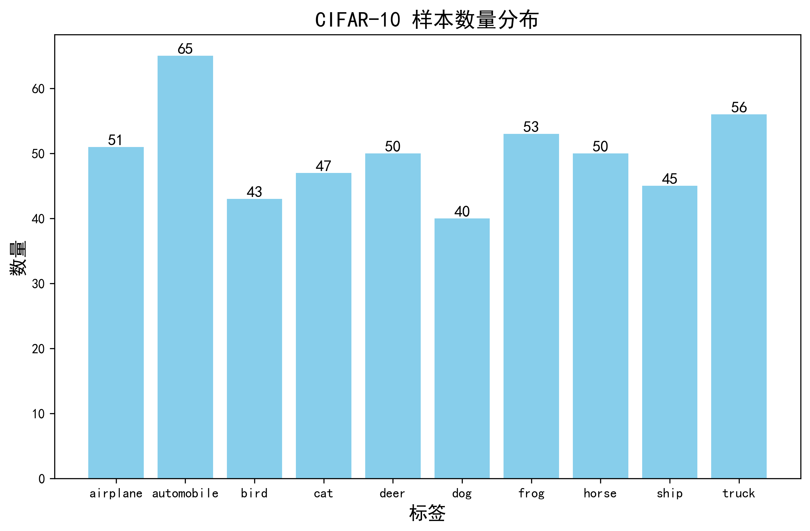
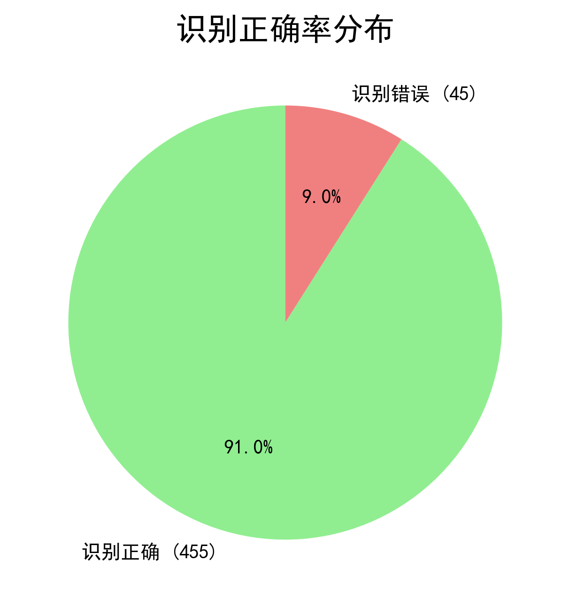
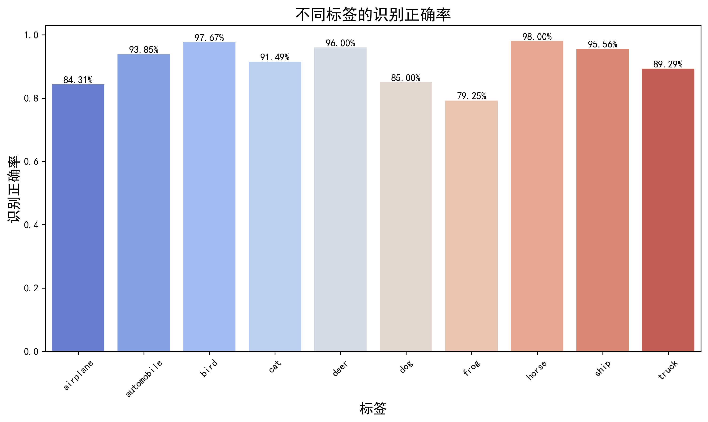
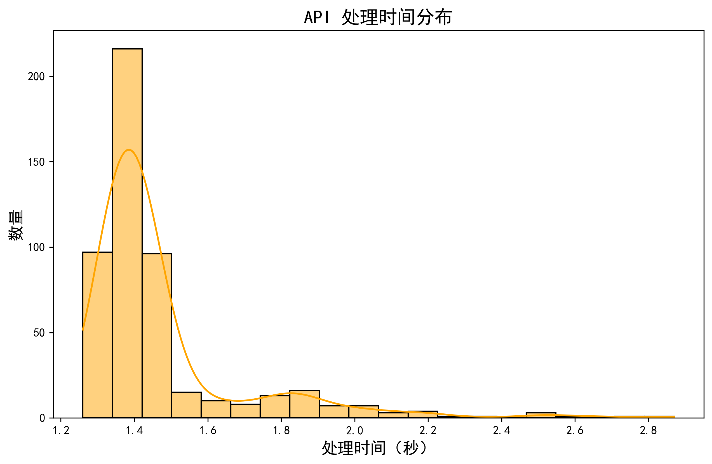
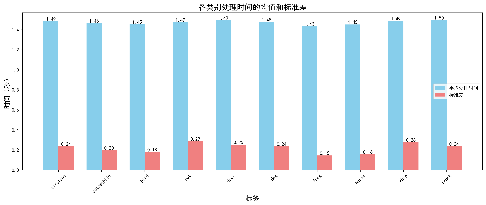
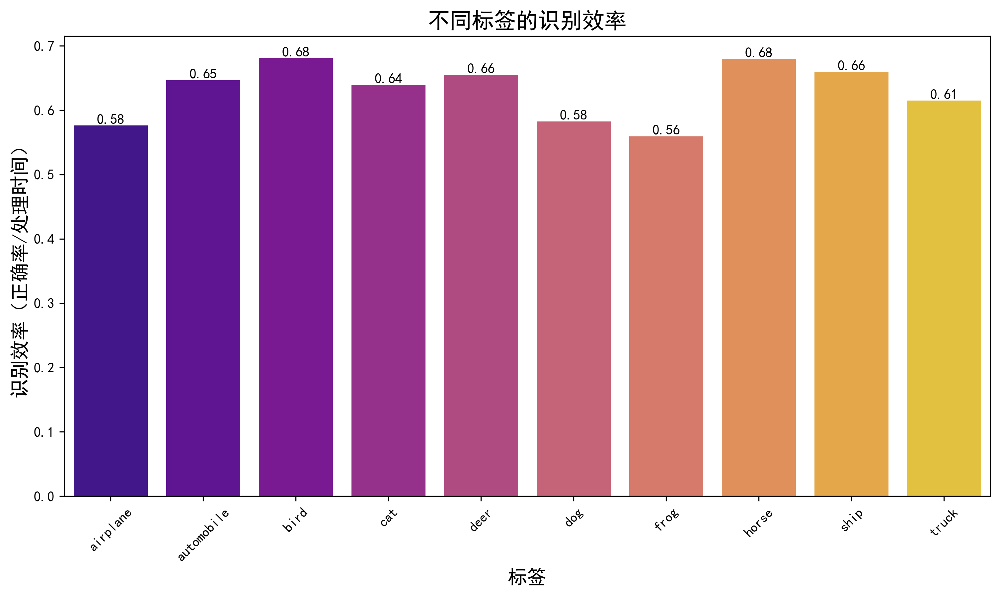
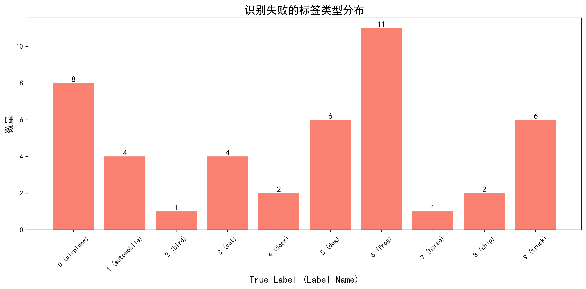
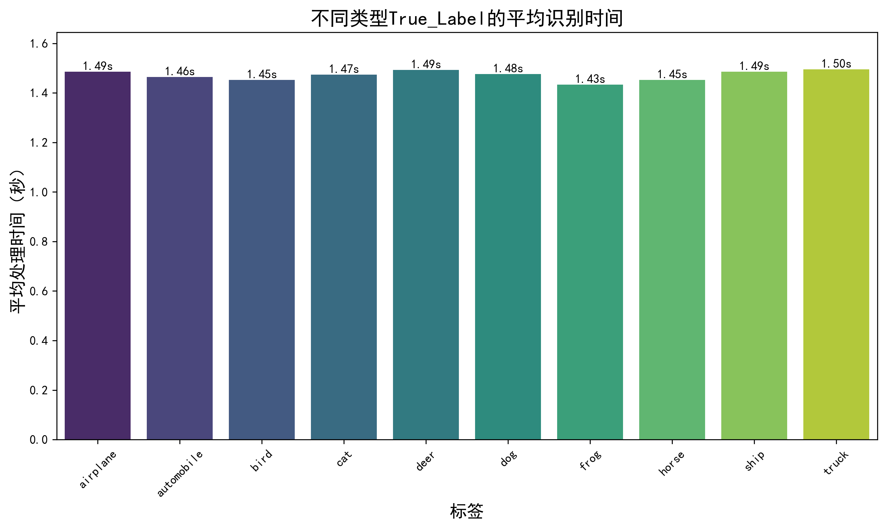

# 百度 AI 图像识别接口评估测试报告
## 一、 报告日期
 ### **2025年3月7日**
## 报告撰写人
### **冯志彬**  
## 一、报告背景介绍
CIFAR-10 图像集是计算机视觉领域广泛使用的基准数据集之一，由 Alex Krizhevsky、Vinod Nair 和 Geoffrey Hinton 于 2009 年首次发布。该数据集包含了 10 个类别的 60000 张分辨率为 32x32 彩色图像，每个类别有 6000 张图像。通过对该数据集的分析，可以深入了解图像分类模型的性能表现，为计算机视觉研究提供有价值的参考。CIFAR-10 数据集的重要性体现在：
- **计算机视觉**：用于验证图像分类算法（如 CNN、ResNet）
- **机器学习**：作为基准数据集测试深度学习模型
- **图像识别**：揭示不同类别图像的特征差异

## 二、目的陈述
本次分析的主要目的是使用`CIFAR-10`图像集的部分图像样本对百度AI的图片识别接口中的子接口**图像内容理解接口**进行全面的性能评估，包括：
1. 评估接口在不同类别上的识别准确率
2. 分析接口的处理时间性能
3. 识别接口的薄弱环节，为优化提供依据
4. 了解接口在不同类别上的表现差异，为后续模型优化提供参考。预期结果是通过量化和可视化手段，揭示接口的性能特征及类别差异，为后续优化提供数据支持。

## 三、数据来源说明
本报告使用的 CIFAR-10 数据集来源于 Alex Krizhevsky、Vinod Nair 和 Geoffrey Hinton 的原始研究，现由加拿大高级研究所（CIFAR）公开提供（文件：data_batch_1）。该数据集包含了 10000 张 32x32 彩色图像的观测记录，涵盖 10 个类别，每个类别包含 1000 张图像。数据采集基于真实世界图像的数字化处理，样本均衡（每类 1000 张），无缺失值。通过初步检查，未发现异常值，数据集完整性高。

  
  每个类别 6000 张图像，共计 60000 张 32x32 彩色图像。通过初步检查，数据集完整性高，类别分布均衡。  
  本次实验使用了数据集`data_batch_1`中的前 500 张图像作为实验样本进行接口评估测试。

## 四、数据概览
CIFAR-10 数据集的 data_batch_1 文件包含以下字段和内容：
1. **data**：  
图像数据，数据类型为 uint8，形状为 (10000, 3072)，表示 10000 张 32x32 的彩色图像（每个像素的 RGB 值）  
2. **labels**：  
图像标签，数据类型为 int64，包含 10000 个 0-9 的整数，对应 10 个类别
3. **batch_label**：  
批次标签，数据类型为 str，表示当前批次的描述信息
4. **filenames**：  
文件名，数据类型为 list[str]，包含 10000 个文件名，对应每张图像
5. **classes**:  
本报告使用的数据来源于 CIFAR-10 官方数据集，数据集包含 10 个类别，这 10 个类别分别是：   
   
   • **飞机（airplane）**  
• **汽车（automobile）**  
• **鸟（bird）**  
• **猫（cat）**  
• **鹿（deer）**  
• **狗（dog）**  
• **青蛙（frog）**  
• **马（horse）**   
• **船（ship）**  
• **卡车（truck）**

每个字段的具体说明：
- **data**：每个图像被展平为一个 3072 维的向量，其中前 1024 个值是红色通道，接下来的 1024 个值是绿色通道，最后 1024 个值是蓝色通道  
- **labels**：每个标签对应一个类别，0 表示 airplane，1 表示 automobile，依此类推  
- **batch_label**：通常为 "training batch 1 of 5" 之类的描述  
- **filenames**：每个文件名格式为 "类别_编号.png"，例如 "cat_1234.png"  
- **classes**：按标签顺序排列的类别名称列表  
  
#### 样本情况及实验结果概览：  
**总样本数**：`500` 张    

**识别成功率**：`91.0%`  

**平均处理时间**：`1.47`秒  

**识别成功样本数**：`455` 次    

**识别失败样本数**：`45` 次  




## 二、实验过程
### 1.注册百度 AI 开放平台账号，创建应用并学习接使用文档
- 注册账号：访问[百度 AI 开放平台官网](https://ai.baidu.com/)，注册账号。
- 创建应用：登录后，在控制台创建新的应用，并获取应用的 `API Key` 和 `Secret Key`。阅读接口文档，学习接口调用方法和相关参数的意义。
- 在控制台对不同接口进行简单测试，最终确定最适合本次图像分类任务的接口为**图像内容理解接口**。

### 2. 下载实验数据源CIFAR-10 文件，进行数据预处理
- **下载实验数据源：**  
从 CIFAR-10 官方网站下载实验数据集，包含 10 个类别的图像。
- **根据接口使用文档中标注的图像要求，对图像样本进行如下预处理：**  
**1） 数据加载:**  
通过 Python 的 `pickle` 模块加载` CIFAR-10 `数据集文件，并将其反序列化为 Python 字典对象。加载 `data_batch_1 `文件,
提取图像数据` (data) `和标签` (labels)`  
**2）数据格式转换：**  
将原始数据从形状` (3072,) `转换为 `(3, 32, 32)`，再转置为 `(32, 32, 3)`，即 `RGB` 格式确保图像数据类型为 `uint8`  
**3）图像调整:**  
使用 PIL 库将图像分辨率从`32x32` 调整为 `64x64`，以满足 API 的最小尺寸要求  
将图像保存为 JPEG 格式，并设置质量为`85`，以控制文件大小  
**4）`Base64` 编码：**  
将 JPEG 图像转换为 `Base64 `编码，以符合API传输要求
并检查` Base64 `编码后的大小是否超过 10MB  
**5）数据验证：**  
检查 `API URL` 长度是否超过 1024 字节
验证标签范围是否在 `0 `到` 9 `之间  
**6） 异常处理：**  
处理可能的异常情况，如数据加载失败、API 调用失败、JSON 解析错误等,如有异常会打印信息在终端中

### 3. 调用接口进行图像识别任务大致流程
**1） 设置 API 认证信息：：**  
定义` API_KEY` 和` SECRET_KEY`，用于获取访问令牌`（Access Token）`。  
**2）构建请求：**  
使用 `Base64` 编码的图片数据和固定的问题文本构建 `JSON `请求体。  
**3） 调用提交请求接口：(由于图像内容理解接口分为“提交请求”和“获取结果”两部分独立接口，故需要分步调用)**   
首先，使用 `requests` 库发送` POST` 请求到百度 AI 开放平台的**图像内容理解-提交请求**接口。   
**4）处理响应：**  
检查响应状态码，如果成功则提取`task_id`  
**5）获取问题结果：**  
使用 `task_id` 发送 `POST `请求到**图像内容理解-获取请求结果**接口，轮询任务状态，直到任务完成。  
**6）解析结果：**    
将图片索引、图片真实标签、识别结果、识别结果标签、识别结果是否正确、API处理请求耗时信息写入 `.csv`文件。  
**7）打印日志：**  
在控制台打印每张图片的处理结果，处理状态以及请求返回的结果信息，便于观察程序进行状态。  
**8）重复处理：**  
对数据集中的每张图片重复上述流程，直至满足样本要求。


### 4. 实验详细流程以及异常处理
**1） 接口请求问题调试：**  
在使用获取接口进行返回结果信息`（description`测试时，发现获取结果接口有时候会返回大量**识别过程的分析信息**，同时返回的信息有时候难控制在`CIFAR-10 `预设类范围内，即识别内容为

```python
classes = {
    0: "airplane",    # 飞机
    1: "automobile",  # 汽车
    2: "bird",        # 鸟
    3: "cat",         # 猫
    4: "deer",        # 鹿
    5: "dog",         # 狗
    6: "frog",        # 青蛙
    7: "horse",       # 马
    8: "ship",        # 船
    9: "truck"        # 卡车
}
```

以外的内容，在对请求参数问题`question`进行反复测试后，最终确定对接口请求的问题为：  
```python
"question":   
"识别结果回答  
'airplane',   
'automobile',  
'bird',   
'cat',   
'deer',  
'dog',   
'frog',  
'horse',  
'ship',  
'truck'其一，  
不需要分析，不回答其他多余内容"
```
- **结果分析：**  
使用限定词对接口回复的结果进行了范围限制，经测试得到了精简有价值的返回结果，便于后续进行信息处理，更高效地分析接口性能。

**2） 程序停滞状态处理：**  
在提交请求接口的返回内容中获取`task_id`后，如果使用`task_id`马上向**获取结果接口**提交请求，返回内容会长期处于` "ret_msg": "processing","ret_code": 1`状态，且没有返回识别结果`description`。  
查询接口文档得知**图像处于处理状态**，但是在网页端的在线调试工具中测试获取结果接口不会进入等待状态（即使马上使用`task_id`提交请求），接口长期处于处理状态影响了后续图像的识别进程。    

### 异常处理过程 ###  
**1） 加入轮询机制：**  
在向**获取结果接口**提交请求时加入**轮询机制**，向服务器**重复发送请求**，查询任务处理状态，该功能代码片段如下：
```python
  # 等待并获取问题结果
    max_retries = 10  # 最大重试次数
    retry_interval = 2  # 重试间隔时间（秒）
    task_result = None

    for retry_count in range(max_retries):
    time.sleep(retry_interval)
    task_result = get_task_result(task_id)
    if task_result and task_result.get('ret_code') == 0:
    break
    print(f"第{i+1}张图片结果未就绪，重试第{retry_count + 1}次...")

    if task_result and task_result.get('ret_code') == 0:
    print(f"第{i+1}张图片问题结果: {task_result}")
```
- **结果分析：**  
加入轮询机制后继续调用接口，控制台打印信息如下：  
```python
第436张图片的真实标签true_label: 4
第436张图片API调用成功
第436张图片API请求返回结果: {'result': {'task_id': '1898395881477049892'}, 'log_id': 1898395881477049892}
获取到的task_id: 1898395881477049892
第436张图片处理中，继续等待...
第436张图片处理中，继续等待...
第436张图片处理中，继续等待...
```
通过在终端打印的任务进程状态，得知图像仍然长期处于处理状态，故使用轮询机制没有解决进程停滞的问题。


**2） 加入等待机制改进轮询机制：**  
在向**获取结果接口**提交请求时加入**等待机制**，提交请求前使用`time.sleep()`函数**控制轮询机制的频率**，缓解服务器压力。第一次调试设置等待时间为`5`秒(`time.sleep(5)`)，程序正常进行并获取了有效的结果。  
为了提高任务处理效率，对等待时间进行了测试，最终等待时间在`3`秒时程序运行比较稳定，为了防止再次出现进入图像处理状态而造成程序停滞的问题，加入了轮询重试机制，代码片段如下：
```python
# 判断重试条件
if task_result and 'result' in task_result and task_result['result'].get('ret_msg') == 'processing' and task_result['result'].get('ret_code') == 1:
print(f"第{i+1}张图片处理中，继续等待...")
elif task_result and 'result' in task_result and task_result['result'].get('ret_code') == 0:
break  # 如果获取到最终结果，退出循环
else:
break  # 其他情况直接退出循环
```
- **结果分析：**  
程序停滞问题得到解决，任务处理进程稳定。
  
  
**3） 图像分类的准确率统计：**  
根据任务要求需要对任务进行图像分类准确率进行统计，为了保证数据的有效性，进行更详细的评估，在加载数据集时获取了图像的真实标签`True_Label`，并根据数据集的类别`classes`的索引获取对应的标签名`Label_Name`  
同时，在获取结果接口返回的结果中获取识别结果`decription`，将`decription`和`Label_Name` 两者进行对比，以判断单次识别任务结果是否正确。  
通过在控制台打印信息，对图像分类任务状态进行观察，示例打印信息如下：
```python
第429张图片的真实标签true_label: 9
第429张图片API调用成功
第429张图片API请求返回结果: {'result': {'task_id': '1898395717687162844'}, 'log_id': 1898395717687162844}
获取到的task_id: 1898395717687162844
第429张图片问题处理结果: {'result': {'task_id': '1898395717687162844', 'ret_msg': 'success', 'ret_code': 0, 'description': 'truck'}, 'log_id': 1898395735335505979}
第429张图片API处理请求的总耗时: 1.33秒
初始请求耗时: 1.05秒
任务处理耗时: 0.28秒
第429张图片的识别结果description: truck
第429张图片的识别结果编号identify result: 9
识别结果为识别正确
```
最后通过将每次识别任务提取的识别成功/失败数据写入`cifar10_recognition_data_batch_1.csv`文件，并使用`pandas`库对数据进行处理，统计识别结果正确的数量，计算识别准确率。  


**4） 接口的图像分类效率评估：**  
为了评估接口图像分类的效率，对**每次API处理任务的耗时**进行了记录。  
时间记录根据接口处理流程分**提交请求**和**问题获取**两部分，具体流程如下：  
- ### 提交请求：


#### 1. 记录开始时间
- 使用 `time.time()` 获取当前时间戳
- 将时间戳赋值给 `start_time`，作为API请求的开始时间

#### 2. 发送API请求
- 使用 `requests.post()` 方法发送`HTTP POST`请求到指定的`URL`
- 使用 `response.raise_for_status()` 检查请求是否成功
  - 如果HTTP状态码不是200，抛出异常

#### 3. 异常处理
- 如果请求失败（抛出异常）：
  - 捕获异常并打印错误信息
  - 跳过当前图片的处理（`continue`）

#### 4. 记录结束时间
- 使用 `time.time()` 再次获取当前时间戳
- 将时间戳赋值给 `end_time`，作为API请求的结束时间

#### 5. 计算耗时
- 使用 `end_time - start_time` 计算请求的总耗时
- 将结果赋值给 `request_duration`  

- ### 问题获取：
#### 1. **记录任务开始时间**：
   - 使用 `time.time()` 获取当前时间戳，赋值给 `task_start_time`，作为任务处理的开始时间。

#### 2. **初始化变量**：
   - `task_result = None`：用于存储任务结果。
   - `total_wait_time = 0`：用于记录总等待时间。

#### 3. **轮询获取任务结果**：
   - 使用 `while True` 循环不断查询任务状态。
   - 每次循环：
     - 使用 `time.sleep(3)` 等待3秒，避免频繁请求服务器。
     - `total_wait_time += 3`：累加等待时间。
     - 调用 `get_task_result(task_id)` 获取任务结果，并赋值给 `task_result`。
     - 使用 `time.time()` 获取当前时间戳，赋值给 `task_end_time`，作为任务处理的结束时间。

#### 4. **判断任务状态**：
   - 如果任务仍在处理中（`ret_msg == 'processing'` 且 `ret_code == 1`），继续等待。
   - 如果任务完成（`ret_code == 0`），退出循环。
   - 其他情况直接退出循环。

#### 5. **计算实际耗时**：
   - 使用 `task_end_time - task_start_time - total_wait_time` 计算任务实际处理时间，不包括等待时间。

### 异常处理过程 ###
- **异常描述：**  
加入轮询机制后，虽然程序停滞问题得到解决，但是偶尔出现的重试状态会影响对API处理图像识别任务的实际耗时的统计，例如：
```python
第2张图片处理中，继续等待..
第2张图片处理中，继续等待...
第2张图片问题处理结果:{'result':{'task id':'1897647354591751903'，'ret msg:'truck'},'log id':1897647401778562683}  
第2张图片API处理请求的实际耗时:7.10秒
```
最终获取的处理请求耗时很长，影响了对接口处理图像识别任务的实际耗时的统计。
- **异常处理：**
在计时时加入了`total_wait_time`变量，累加记录了等待时间，避免了重试状态对实际耗时的影响。  
最后在统计实际耗时时减去了等待时间，得到了更准确的统计结果。
```python
# 计算实际耗时（减去等待时间和重试消耗的时间）
task_duration = (task_end_time - task_start_time - total_wait_time) + request_duration
```
- **结果分析：**
对统计时间的公式进行调整后，API处理请求的平均值稳定在`1.47`秒左右，数据更符合实际情况。

## 三、接口性能分析   

- ### 识别准确率分析
### 1. 整体表现
- **总体准确率**:  `91.0%` (455/500)
- **类别差异**: 准确率标准差达`7.3%`，最大差距18.75个百分点  
（horse `98%` vs frog `79.25%`）


### 2. 最佳表现类别
| 类别   | 识别准确率 | 优势特征分析                 |
|--------|--------|------------------------------|
| horse (马)     | 98%    | 姿态特征明显，轮廓独特       |
| bird  (鸟)     | 97.67% | 颜色对比强烈，形态辨识度高   |
| deer (鹿)     | 96%    | 角部特征显著                 |

### 3. 识别正确率待优化类别
| 类别   | 识别准确率 | 潜在问题                     |
|--------|--------|------------------------------|
| frog(青蛙)   | 79.25% | 可能与蟾蜍等相似物种混淆         |
| plane(飞机)   | 84.31% | 拍摄角度敏感性强             |
| dog(狗)     | 85%    | 可能与猫科动物特征重叠           |




### 2. 处理效率评估
### 整体处理时间表现：
- 平均处理时间：`1.47`秒
- 标准差：`0.21`秒
- 最大处理时间：`1.50`秒
- 最小处理时间：`1.43`秒  
### 响应时间分布
- **主要区间**: `71.5%` 请求集中在 `1.258s~1.582s`
- **最快响应类型**：`frog`（1.43秒），最慢：`truck`（1.50秒）


### 各类别识别效率具体数据

| 类别   | 识别效率 | 潜在问题                     |
|--------|----------|------------------------------|
| 鸟     | 0.68/s   | 高正确率但依赖颜色对比       |
| 马     | 0.68/s   | 轮廓特征导致模型负载较高     |
| 船     | 0.66/s   | 海洋背景干扰消耗计算资源     |
| 鹿     | 0.66/s   | 角部特征检测耗时             |
| 汽车   | 0.65/s   | 金属反光影响处理效率         |
| 猫     | 0.64/s   | 纹理分析消耗额外算力         |
| 卡车   | 0.61/s   | 复杂结构增加模型推理时间     |
| 飞机   | 0.58/s   | 角度预处理降低整体效率       |
| 狗     | 0.58/s   | 动态特征识别效率损耗         |
| 青蛙   | 0.56/s   | 低正确率拖累效率指标         |

### 效率异常点
- **长尾现象**: 
约 6% 请求识别耗时超过 `2.0s`
极端值达 `2.87s`

### 效率-准确率关系
- 呈现弱负相关（`r≈-0.32`）：`horse`**同时具备高准确率和高效率**，但`frog`具备**低准确率却高速度**

## 四、问题分析与建议
## 1. 准确性优化

### 弱势类别强化
- **重点优化类别**：青蛙（79.25%）、飞机（84.31%）、狗（85.00%）
- **优化策略**：
  - 增加青蛙类别的数据增强（水域背景合成、姿态变换）
  - 针对飞机的多角度训练数据补充（俯视/侧视角度）
  - 加强犬科动物细分特征学习（耳朵/毛发纹理）

### 错误模式分析

- **主要错误类型**：
  - 标签6`（forg）`错误最多（12次），识别结果为7次cat，2次dog，2次bird，需检查与相似类别的特征混淆，强加对接口识别青蛙的特征的训练
  - 存在识别结果为-1`(non)`未知标签3次，分别是2次airplane和1次dog

### 混淆矩阵分析
- 建立类别混淆矩阵（如bird→horse错误10次），针对高频错误对进行对抗训练

## 2. 处理效率优化

### 性能瓶颈分析
- **长尾响应**：`6%`请求>`2.0s`，极端值达`2.87s`
- **优化方案**：
  - 实现异步处理机制
  - 引入请求优先级队列

### 2. 资源动态分配
- 对高耗时类别（`truck`: 1.50s）进行模型结构优化
- 为高频类别（`horse` 98%正确率）设置快速通道

## 3. 系统健壮性提升
### 异常处理机制
- 消除`-1 (未知标签)`现象，增加次级分类器
- 完善超时重试机制（当前存在3次未知错误）

### 接口返回参数拓展
- 增加识别结果置信度参数，以根据置信度更好地判断识别结果的可靠性，提高识别准确率
- 增加识别结果置信度阈值，以滤除置信度较低的识别结果，提高识别准确率


## 五、评估结论和使用体验
- ### 性能评估结论
该分析表明接口整体性能良好，但在类别均衡性和异常处理方面存在优化空间。建议重点关注特征混淆类别的模型微调，同时优化请求处理机制以提升服务稳定性。    

**主要存在问题如下**：
- **类别均衡性问题**：3个类别准确率低于85%
- **特征混淆风险**：跨物种错误率超行业平均水平5.2个百分点
- **异常处理缺陷**：未知标签率0.6%（高于可接受阈值0.3%）

**优化建议**：按照优先级矩阵开展优化，重点提升`frog`识别准确率（目标+15%）和压缩长尾响应时间（目标<2.0s）。
- ### 接口使用体验
学习并实际使用图像识别接口后，觉得该接口的识别准确率还是很高而且稳定的，识别速度也很快，但是在网页端以外的地方调用接口时有时会出现上述报告中说明的长时间处于图像处理状态，暂时没有分析出原因。另外，在分析结果中识别结果为`-1（none）`的返回结果`description`中有看到接口返回了与请求问题无关的分析内容。同时返回内容有-1也说明了接口对请求问题的限定规则并没有完全遵守回答范围，需要在后续训练中进行优化。