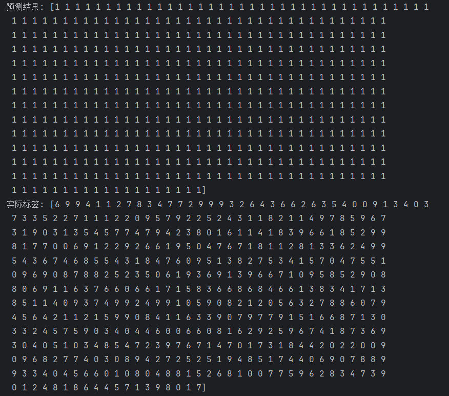
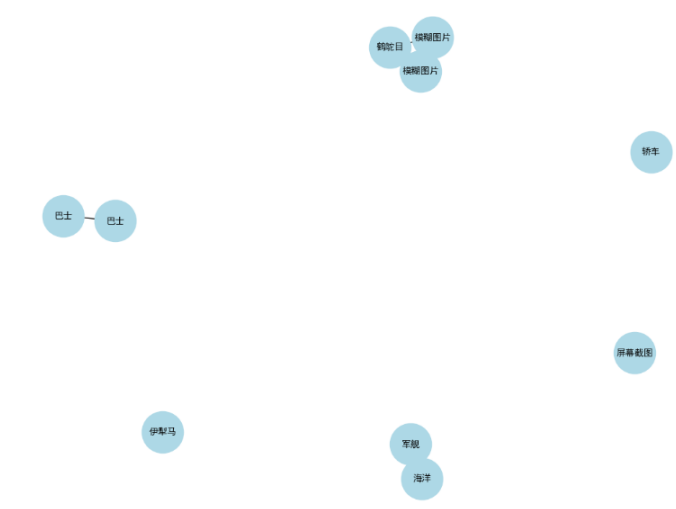
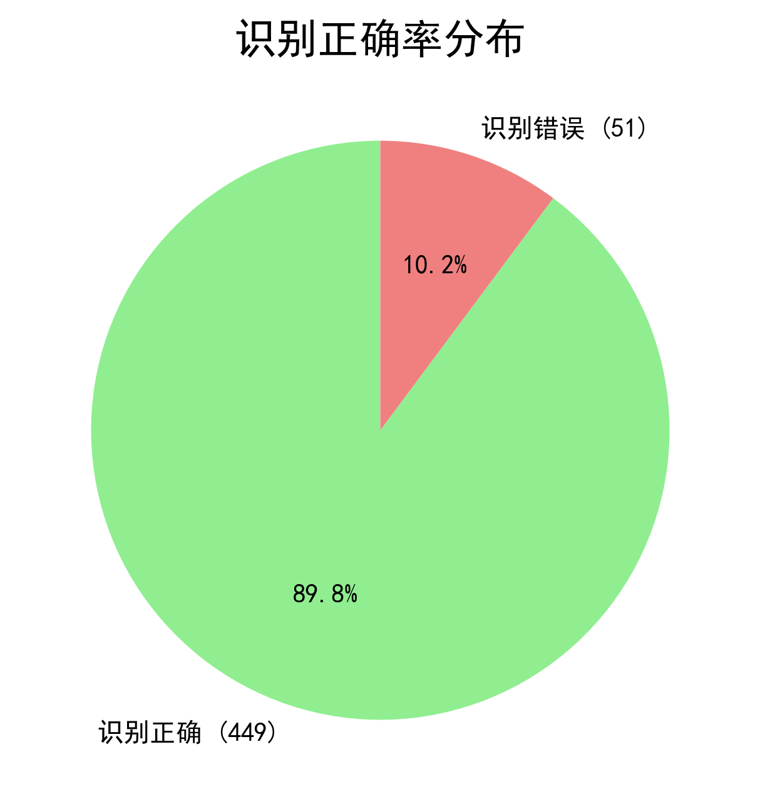
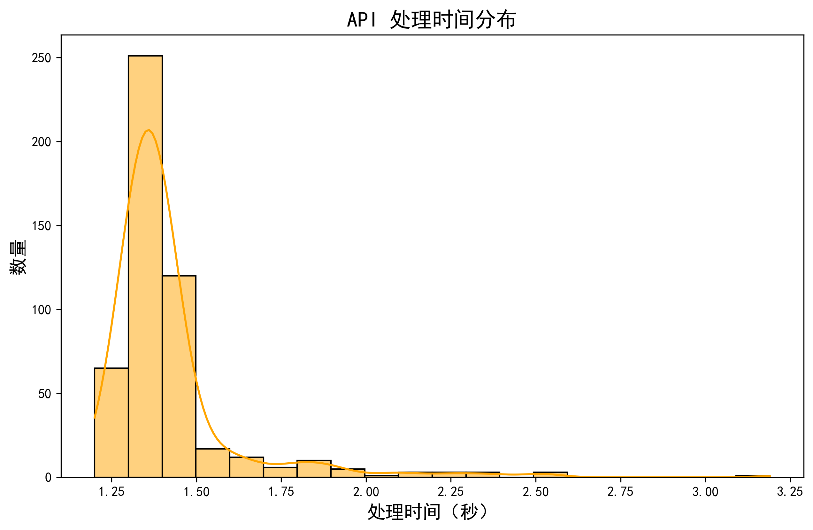

# 图神经网络模型训练报告
## 方案一：基于图像语义关系图，利用百度AI图像识别API提取语义特征，根据相似度构建图，节点为图像，边为语义关联。

### 第一次训练结果：  
  
预测结果中的唯一值: [1]  
实际标签中的唯一值: [0 1 2 3 4 5 6 7 8 9]  

|  | precision（精确率） | recall（召回率） | f1-score（F1分数） | support（支持数） |
| ---- | ---- | ---- | ---- | ---- |
| airplane（飞机） | 1.00 | 0.00 | 0.00 | 51 |
| automobile（汽车） | 0.13 | 1.00 | 0.23 | 65 |
| bird（鸟） | 1.00 | 0.00 | 0.00 | 43 |
| cat（猫） | 1.00 | 0.00 | 0.00 | 47 |
| deer（鹿） | 1.00 | 0.00 | 0.00 | 50 |
| dog（狗） | 1.00 | 0.00 | 0.00 | 40 |
| frog（青蛙） | 1.00 | 0.00 | 0.00 | 53 |
| horse（马） | 1.00 | 0.00 | 0.00 | 50 |
| ship（船） | 1.00 | 0.00 | 0.00 | 45 |
| truck（卡车） | 1.00 | 0.00 | 0.00 | 56 |
| accuracy(准确率) |  |  | 0.13 | 500 |
| macro avg（宏平均） | 0.91 | 0.10 | 0.02 | 500 |
| weighted avg（加权平均） | 0.89 | 0.13 | 0.03 | 500 | 
### 结果指标解读： 
1. Precision（精确率）
- 定义：预测为正类的样本中，实际为正类的比例。
- 公式：Precision = TP / (TP + FP)
- 解释：
    - 所有类别的精确率均为1.00，说明模型预测为正类的样本中，确实为正类的比例很高。
    - 但结合召回率来看，模型将所有样本都预测为汽车，因此精确率的高值并不代表模型性能好。

2. Recall（召回率）
- 定义：实际为正类的样本中，被正确预测为正类的比例。
- 公式：Recall = TP / (TP + FN)
- 解释：
    - 只有汽车类别的召回率为1.00，其他类别的召回率均为0.00，说明模型将所有样本都预测为汽车，导致其他类别的样本未被正确识别。

3. F1-score（F1分数）
- 定义：精确率和召回率的调和平均数，用于综合评估模型性能。
- 公式：F1 = 2 * (Precision * Recall) / (Precision + Recall)
- 解释：
    - 所有类别的F1-score均为0.00，表明模型在精确率和召回率之间没有找到平衡，无法正确分类。

4. Support（支持数）
- 定义：每个类别的实际样本数量。
- 解释：
    - 例如，飞机类有51个样本，汽车类有65个样本，依此类推。

5. Accuracy（准确率）
- 定义：所有样本中，被正确分类的比例。
- 公式：Accuracy = (TP + TN) / (TP + TN + FP + FN)
- 解释：
    - 整体准确率为13%，**接近随机猜测（10%）**，表明**模型未能有效学习数据的分类特征。**  
6. Macro Avg（宏平均）
- 定义：对所有类别的指标（精确率、召回率、F1-score）取算术平均。
- 解释：
    - 宏平均精确率为0.91，召回率为0.10，F1-score为0.02，表明模型在所有类别上的平均表现很差。

7. Weighted Avg（加权平均）
- 定义：根据每个类别的样本数量，对指标进行加权平均。
- 解释：
    - 加权平均精确率为0.89，召回率为0.13，F1-score为0.03，表明模型在样本较多的类别上表现略好，但整体仍然不理想。

## 训练结果评估
## 问题表现
当前模型的表现表明其未能有效学习数据的分类特征。
- 预测结果单一：所有样本的预测结果都是1（汽车），说明模型没有学习到有效的分类特征。
- 准确率低：整体准确率仅为13%，与随机猜测（10%）接近。
- 召回率异常：只有汽车类别的召回率为1.00，其他类别的召回率均为0.00，说明模型将所有样本都预测为汽车。
- F1-score低：所有类别的F1-score均为0.00，表明模型无法正确分类。

2. 原因分析
### 数据问题
- 类别不平衡：如果数据集中汽车类别的样本数量显著多于其他类别，模型可能会倾向于将所有样本预测为汽车。
- 特征提取问题：如果输入特征（如图像特征或图结构）没有有效区分不同类别，模型无法学习到有意义的分类边界。

### 模型问题
- 模型复杂度不足：当前模型可能过于简单，无法捕捉复杂的图结构和特征关系。
- 训练不足：模型可能没有充分训练，导致未能收敛到有效解。
- 损失函数问题：如果损失函数设计不合理，模型可能会陷入局部最优，导致预测结果单一。

### 图结构问题
- 图构建不合理：如果图的边权重或结构没有反映真实的语义关系，模型无法从图中学习到有用的信息。
- 节点特征无效：如果节点特征（如图像特征）没有区分性，模型无法进行分类。

3. 改进建议
### 数据层面
- 检查数据分布：确保数据集中各类别样本数量均衡。
- 增强特征提取：使用更强大的特征提取方法（如预训练的CNN模型）来生成节点特征。

### 模型层面
- 增加模型复杂度：尝试更深的GCN层或引入注意力机制。
- 调整损失函数：使用加权交叉熵损失函数，解决类别不平衡问题。
- 增加正则化：引入Dropout或L2正则化，防止过拟合。

### 训练层面
- 调整学习率：尝试更小的学习率，确保模型能够稳定训练。
- 增加训练轮数：延长训练时间，确保模型充分收敛。
- 早停机制：监控验证集性能，防止过拟合。

### 图结构层面
- 优化图构建：重新设计图的边权重和结构，确保其反映真实的语义关系。
- 引入多模态特征：结合图像特征和图结构特征，提升模型的分类能力。

通过对程序复盘和构建过程可视化，发现问题出在图构建上，通过百度图像识别API提取的语义特征过于分散，未能集中在数据集的特征上，导致图构建的边权重和结构过于稀疏，模型无法从图中学习到有用的信息。  
  
#### 优化策略
修改说明  
1.提取前 3 个高置信度类别：
使用 sorted 对结果按置信度排序，取前 3 个类别。
将多个类别存储为集合 {r['keyword'] for r in top_results}。   
2.降低相似度阈值：
将 threshold 从 0.2 降低到 0.1，允许更多的边被创建。  
3.打印更多信息：
打印每个图像的多个语义特征及其置信度，方便调试。
#### 优化结果
经过优化后仍未得到理想的训练结果，因此考虑使用方案二：基于图像特征关系图，提取局部特征（如SIFT、HOG），构建图结构，节点为特征，边为空间或关联关系继续模型训练实验。   

## 方案二：基于图像特征关系图，提取局部特征（如SIFT、HOG），构建图结构，节点为特征，边为空间或关联关系    
## 第一次训练结果:
|  | precision（精确率） | recall（召回率） | f1-score（F1分数） | support（支持数） |
| ---- | ---- | ---- | ---- | ---- |
| airplane（飞机） | 0.23 | 0.14 | 0.17 | 51 |
| automobile（汽车） | 0.10 | 0.32 | 0.15 | 47 |
| bird（鸟） | 0.09 | 0.02 | 0.03 | 56 |
| cat（猫） | 0.12 | 0.11 | 0.12 | 45 |
| deer（鹿） | 0.07 | 0.04 | 0.05 | 49 |
| dog（狗） | 0.14 | 0.07 | 0.09 | 45 |
| frog（青蛙） | 0.21 | 0.06 | 0.09 | 54 |
| horse（马） | 0.00 | 0.00 | 0.00 | 52 |
| ship（船） | 0.12 | 0.15 | 0.13 | 54 |
| truck（卡车） | 0.13 | 0.30 | 0.18 | 47 |
| accuracy（准确率） |  |  | 0.12 | 500 |
| macro avg（宏平均） | 0.12 | 0.12 | 0.10 | 500 |
| weighted avg（加权平均） | 0.12 | 0.12 | 0.10 | 500 |
 测试准确率: 0.1160

预测标签分布: [ 30 150  11  40  30  21  14  27  66 111]  
真实标签分布: [51 47 56 45 49 45 54 52 54 47]  
训练耗时：40:42

## 训练结果评估
## 问题表现
1. 整体准确率低：
    - 测试准确率仅为11.6%，远低于随机猜测的10%
    - 表明模型未能有效学习到数据的特征
2. 各类别表现不平衡：
    - 汽车和卡车的召回率相对较高（0.32和0.30），但精确率很低
    - 马的各项指标均为0，说明模型完全无法识别该类
    - 其他类别的性能普遍较差
3. 预测分布偏差：
    - 预测标签分布与真实标签分布差异显著
    - 模型过度预测了某些类别（如汽车和卡车），而忽略了其他类别
### 可能原因分析：
1.  数据问题：
- 特征提取可能不够有效
- 数据划分或预处理存在问题
- 类别不平衡可能影响模型学习
2. 模型问题：
- 图卷积层可能无法有效捕捉图像特征
- 分类器结构可能过于简单
- 训练参数（如学习率）可能需要调整  

### 优化策略：
### 训练模型优化
#### 1.图结构优化   
边数量过多：训练集和测试集的边数量都超过1000万，这可能导致图过于密集，影响模型学习。  
增加空间距离阈值，减少边的数量  
使用KNN方法，每个节点只连接最近的k个邻居  
引入边权重，根据空间距离或特征相似度进行加权  
#### 实际优化：
1. 模型结构优化：
- 增加图卷积层的数量和通道数 
```python 
self.bn1 = nn.BatchNorm1d(hidden_dim)  # 添加BatchNorm
self.conv2 = GCNConv(hidden_dim, hidden_dim)
self.bn2 = nn.BatchNorm1d(hidden_dim)  # 添加BatchNorm
self.dropout = nn.Dropout(0.5)  # 添加Dropout
```
2. 超参数调整：
```python
config = {
    "hidden_dim": 512,  # 增加隐藏层维度
    "learning_rate": 0.0005,  # 降低学习率
    "epochs": 200,  # 增加训练轮数
    "batch_size": 32,  # 调整batch size
    "train_ratio": 0.7,
    "val_ratio": 0.15,
    "device": torch.device('cuda' if torch.cuda.is_available() else 'cpu')
}
```
3. 训练策略优化：
- 添加学习率调度器：
```python
optimizer = optim.Adam(model.parameters(), lr=config["learning_rate"])
scheduler = torch.optim.lr_scheduler.StepLR(optimizer, step_size=30, gamma=0.1)  # 每30个epoch学习率衰减
```
4. 损失函数优化：
- 使用加权交叉熵损失，解决类别不平衡问题：
```python
class_counts = torch.bincount(train_data.y)
class_weights = 1. / class_counts.float()
criterion = nn.CrossEntropyLoss(weight=class_weights.to(config['device']))
```
5. 数据预处理优化：
- 对节点特征进行归一化：
```python
def create_pyg_data(npz_data, mask):
    # ... existing code ...
    x = torch.tensor(npz_data['node_feat'], dtype=torch.float)
    x = (x - x.mean(dim=0)) / (x.std(dim=0) + 1e-8)  # 添加归一化
    # ... existing code ...
```
### 关系图构建优化：
1. 特征提取优化：
``` python
def extract_sift_features(image):
    gray = cv2.cvtColor(image, cv2.COLOR_RGB2GRAY)
    sift = cv2.SIFT_create(contrastThreshold=0.03, edgeThreshold=10)  # 调整SIFT参数
    kp, des = sift.detectAndCompute(gray, None)
    if des is None:
        des = np.zeros((1, 128))
    # 添加特征归一化
    des = (des - des.mean(axis=0)) / (des.std(axis=0) + 1e-8)
    return des
```
2.图结构优化：
```python
def build_spatial_edges(features, image_size=32, grid_size=8, max_neighbors=10):
    # ... existing code ...
    # 修改边构建逻辑，限制最大邻居数
    edges = []
    cell_size = image_size // grid_size
    kdtree = KDTree(features[:, :2])  # 使用KDTree加速近邻搜索
    
    for idx, (x, y) in enumerate(features[:, :2]):
        # 查找最近的max_neighbors个邻居
        dists, indices = kdtree.query([x, y], k=max_neighbors+1)
        for neighbor_idx in indices[1:]:  # 跳过自己
            edges.append((idx, neighbor_idx))
    
    print(f"生成的边数量: {len(edges)}")
    return edges
```
3.数据保存优化（提高读写效率，降低内存压力）：
```python
# 修改数据保存方式，添加压缩
save_train_path = '../train_sift_graph.npz'
np.savez_compressed(save_train_path,  # 使用压缩格式
                   node_feat=train_node_feat,
                   edges=np.column_stack([train_edge_src, train_edge_dst]),
                   node_image_map=train_node_image_map,
                   labels=np.array(train_labels))
```

## 第二次训练结果：


| 英语（中文） | Precision（精确率） | Recall（召回率） | F1-score（F1分数） | Support（支持数） |
| ---- | ---- | ---- | ---- | ---- |
| airplane（飞机） | 0.06 | 0.06 | 0.06 | 51 |
| automobile（汽车） | 0.12 | 0.15 | 0.13 | 47 |
| bird（鸟） | 0.10 | 0.12 | 0.11 | 56 |
| cat（猫） | 0.08 | 0.11 | 0.09 | 45 |
| deer（鹿） | 0.26 | 0.18 | 0.22 | 49 |
| dog（狗） | 0.07 | 0.04 | 0.05 | 45 |
| frog（青蛙） | 0.20 | 0.26 | 0.23 | 54 |
| horse（马） | 0.07 | 0.04 | 0.05 | 52 |
| ship（船） | 0.17 | 0.07 | 0.10 | 54 |
| truck（卡车） | 0.16 | 0.26 | 0.20 | 47 |
| Accuracy（准确率） |  |  | 0.13 | 500 |
| Macro Avg（宏平均） | 0.13 | 0.13 | 0.12 | 500 |
| Weighted Avg（加权平均） | 0.13 | 0.13 | 0.12 | 500 |
总训练耗时: 45.02秒
平均每个epoch耗时: 0.22秒
测试准确率: 0.1300
预测标签分布: [50 59 68 61 34 30 70 29 23 76]
真实标签分布: [51 47 56 45 49 45 54 52 54 47]
测试总耗时: 0.1030秒
平均处理时间: 0.000206秒/样本
  
#### 对比第一次训练：
#### 训练质量：
第一次训练：Epoch 100 | Train Loss: 1.9085 |Best Loss: 1.9085
第二次训练：Epoch 200 | Train Loss: 0.0139 | Best Loss: 0.0139 
- 问题评估：
从训练结果来看，模型在训练集上的损失已经降到了0.0169，这是一个相对较低的值，表明模型在训练集上已经较好地拟合了数据 
- 训练损失：0.0139，表明模型在训练集上表现良好  
- 测试准确率：13%，远低于训练集表现  
- 过拟合风险：训练损失低但测试准确率低，表明模型可能过拟合了训练数据
#### 可能原因分析：

1.数据问题：

训练集和测试集分布不一致  
特征提取可能不够有效，导致模型学习到噪声  
数据量不足，模型无法泛化  
2. 模型问题：

模型复杂度可能过高，导致过拟合  
正则化不足，如Dropout率或权重衰减不够  
图结构可能无法有效捕捉图像特征  
3. 训练策略：

学习率可能过高，导致模型陷入局部最优
训练轮数过多，导致过拟合
缺乏验证集监控，无法及时调整训练策略

### 主要原因：训练过拟合，以及模型缺乏泛化能力

## 百度API分类结果：
1. 识别正确率：整体识别正确率为89.8%（449/500），表现较好，但不同类别间差异较大
  
2. 处理时间分布：  
大部分样本（316/500）处理时间在1.198-1.399秒之间  
少数样本（29/500）处理时间超过1.996秒
  
API平均处理时间为：1.42秒
GCN模型平均处理时间为：0.000206秒/样本
虽然模型经过训练后能够快速处理样本，但是GCN模型准确率远低于百度图像识别接口的处理结果。需要优化模型的泛化能力。

