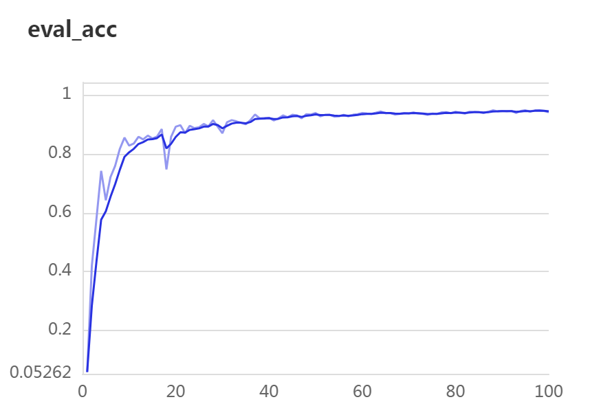

# PaddlePaddle 和 PGL 的端到端图像识别系统实验
## 集成系统设计
#### 系统设计  
根据端到端图像识别系统的定义，系统可以分为如下四个主要功能模块 ：  
1. 数据收集与预处理  
2. 模型构建与训练  
3. 模型评估与优化
4. 模型部署与应用

### 模块具体实现
### 一、 数据预处理模块：
- 数据来源：flowers102数据集   
- 该模块主要分为数据清洗和特征提取与关系图构建两模块
#### 1）数据清洗程序设计如下：
 1. 数据加载
- **目标**：从 `flowers102` 数据集中加载训练集和验证集的图像路径及标签。
- **实现**：
  - 使用 `with open` 读取 `train_list.txt` 和 `val_list.txt` 文件，获取图像路径和标签。
  - 将图像路径和标签分别存储在 `train_image_paths`、`train_labels`、`val_image_paths` 和 `val_labels` 中。

 2. 数据清洗
- **目标**：对加载的数据进行清洗，确保数据质量。
- **实现**：
  - **检查图像有效性**：
    - 使用 `check_images` 函数检查图像文件是否有效，跳过无法读取的图像。
  - **检查标签有效性**：
    - 使用 `check_labels` 函数检查标签是否在有效范围内（0 到 101），跳过无效标签。
  - **去除重复数据**：
    - 使用 `remove_duplicates` 函数去除重复的图像和标签。
  - **统一图像格式**：
    - 使用 `convert_image_format` 函数将图像统一转换为 `.jpg` 格式。

 3. 数据可视化
- **目标**：通过可视化手段展示数据分布和清洗结果。
- **实现**：
  - **标签分布图**：
    - 使用 `plot_and_save_label_distribution` 函数绘制并保存标签分布图。
  - **数据集摘要图**：
    - 使用 `plot_dataset_summary` 函数绘制并保存训练集和验证集的图片总数和标签总数。

 4. 主函数
- **目标**：协调上述步骤，完成数据加载、清洗和可视化。
- **实现**：
  - 在 `main` 函数中依次调用数据加载、数据清洗和数据可视化的函数。
  - 打印调试信息，方便跟踪程序运行状态。


#### 2）特征提取与关系图构建模块设计如下：
 1. 数据加载
- **目标**：从 `flowers102` 数据集中加载训练集和验证集的图像路径及标签。
- **实现**：
  - 使用 `with open` 读取 `train_list.txt` 和 `val_list.txt` 文件，获取图像路径和标签。
  - 将图像路径和标签分别存储在 `train_image_paths`、`train_labels`、`val_image_paths` 和 `val_labels` 中。

 2. 特征提取
- **目标**：使用PaddleClas预训练模型 `PP-ShiTuV2` 提取图像特征。
- **实现**：
  - 定义 `extract_features_with_ppshitu` 函数，使用 `PP-ShiTuV2` 模型对每张图像进行特征提取。
  - 提取的特征为 512 维向量，并进行 L2 归一化处理。
  - 将提取的特征存储在 `train_features` 和 `val_features` 中。

 3. 图结构构建
- **目标**：基于特征相似度构建图结构，生成节点之间的边。
- **实现**：
  - 定义 `build_spatial_edges` 函数，使用 KDTree 计算特征之间的欧氏距离。
  - 动态调整距离阈值，基于 KNN 算法筛选有效边。
  - 结合特征相似度和空间距离计算边权重。
  - 如果没有找到有效边，则创建默认的全连接图。

 4. 图数据保存
- **目标**：将图数据保存为 `.npz` 文件，供后续模型训练使用。
- **实现**：
  - 定义 `save_graph_data` 函数，将节点特征、边数据、标签和节点图像映射保存为 `.npz` 文件。
  - 调整边数据格式为 `(2, num_edges)`，以符合 PyTorch Geometric 的输入要求。
  - 保存训练集和验证集的图数据为 `train_graph_test.npz` 和 `val_graph_test.npz`。

 5. 主函数
- **目标**：协调上述步骤，完成图数据的生成和保存。
- **实现**：
  - 在 `main` 函数中依次调用数据加载、特征提取、图结构构建和图数据保存的函数。
  - 打印调试信息，方便跟踪程序运行状态。

### 二、 模型构建与训练模块：
 1. 数据加载与预处理
- **目标**：加载 `.npz` 文件中的图数据，并将其转换为 PyTorch Geometric 的 `Data` 对象。
- **实现**：
  - 使用 `load_and_split_data` 函数加载 `.npz` 文件，提取边、节点特征、标签和节点图像映射。
  - 使用 `create_pyg_data` 函数将数据转换为 PyTorch Geometric 的 `Data` 对象，并进行维度检查以确保数据格式正确。

 2. 模型设计
- **目标**：设计基于 GCN 的图像分类模型。
- **实现**：
  - **基础模型**：
    - 定义 `ImageGCN` 类，包含两层 GCN 卷积层、BatchNorm 层和分类器。
    - 使用 `global_mean_pool` 进行图级别的特征聚合。
  - **改进模型**：
    - 定义 `ImprovedImageGCN` 类，在基础模型的基础上增加一层 GCN 卷积层，以增强特征提取能力。

 3. 训练与验证
- **目标**：训练模型并在验证集上评估性能。
- **实现**：
  - 使用 Adam 优化器和交叉熵损失函数进行训练。
  - 在每个 epoch 中计算训练集损失和准确率，并记录到 VisualDL 中。
  - 在验证集上评估模型性能，保存最佳模型。

 4. 可视化与日志记录
- **目标**：记录训练过程中的关键指标，便于分析和调试。
- **实现**：
  - 使用 VisualDL 记录训练损失、训练集准确率和验证集准确率。
  - 在控制台打印分类报告，展示模型的分类性能。

 5. 主函数
- **目标**：协调上述步骤，完成数据加载、模型训练和验证。
- **实现**：
  - 在 `main` 函数中依次调用数据加载、模型初始化、训练循环和验证评估的函数。
  - 捕获并处理异常，确保程序在出错时能够提供有用的调试信息。

### 三、模型评估与优化  
该模块合并在了模型训练程序中，于训练过程中记录了损失loss和正确率Train Accuracy。
在最后使用验证集验证时使用类别级别指标：  
- Precision（精确率）  
- Recall（召回率）  
- F1-Score（F1分数）  
- Support（支持数）  
使用整体性能指标：   
- Accuracy（准确率）
- Macro Avg（宏平均）
- Weighted Avg（加权平均）  
上述指标作为模型评估指标，评估模型训练和验证表现，根据表现对模型训练参数和结构进行相应优化   
### 四、模型部署与应用
在模型训练评估部分保存了训练后性能最佳的模型，保存逻辑为：如果当前验证集准确率 val_acc 大于 best_val_acc，则更新 best_val_acc 并保存模型。  
随机挑选了验证集的十张图片进行预测，输出图片样本的实际标签和模型的预测结果。  

### 五、集成程序  
设计了一个主程序用于集成和封装系统，
- 使用 `run_script` 函数封装脚本运行逻辑，便于复用和扩展。
- 每个脚本的运行结果和错误信息都会被捕获和处理，确保程序的健壮性。
- 在 `main` 函数中按顺序调用各个脚本，形成一个完整的流水线。
- 使用 `try-except` 结构捕获异常，确保在出现错误时能够及时处理并输出错误信息。  

## 实际运行和结果评估：
###  1.数据清洗 ：  
对数据集进行数据检查和清洗，未发现数据异常，控制台输出如下：  
```
正在清洗数据...
数据清洗完成，无异常
正在清洗数据...
数据清洗完成，无异常
清洗后训练集图像数量: 1020
清洗后验证集图像数量: 1020
```   
可视化结果如下  
  
可见数据集结构完整，类别分布均匀  

2.特征提取和关系图构建：
提取和构建后的数据形状输出如下：
```
保存数据前调试信息：
节点特征形状: (1020, 512)
边数据形状: (2, 8395)
标签形状: (1020,)
节点图像映射形状: (1020,)
训练图数据保存完成

保存数据前调试信息：
节点特征形状: (1020, 512)
边数据形状: (2, 8547)
标签形状: (1020,)
节点图像映射形状: (1020,)
测试图数据保存完成
```
#### 解读：
1. 节点特征形状: (1020, 512)   
含义：
节点特征矩阵的形状为 (1020, 512)，表示图中有 1020 个节点，每个节点的特征向量维度为 512（预训练模型默认提取维度）。 

2. 边数据形状: (2, 8395) 和 (2, 8547)  
含义：
边数据的形状为 (2, 8395) 和 (2, 8547)，表示图中有 8395 条边和 8547 条边，每条边由两个节点索引组成。

3. 标签形状: (1020,)  
含义：
标签的形状为 (1020,)，表示有 1020 个标签，每个标签对应一个节点的类别。

4. 节点图像映射形状: (1020,)  
含义：
节点图像映射的形状为 (1020,)，表示有 1020 个节点与图像的映射关系。  
### 2.模型训练和评估   
训练后输出分类结果如下：  
### 模型评估结果

| 标签  | Precision | Recall | F1-Score | Support |
|------|-----------|--------|----------|---------|
| 0    | 0.5000    | 0.7000 | 0.5833   | 10      |
| 1    | 0.8889    | 0.8000 | 0.8421   | 10      |
| 2    | 0.4286    | 0.3000 | 0.3529   | 10      |
| 3    | 0.3125    | 0.5000 | 0.3846   | 10      |
| 4    | 0.4091    | 0.9000 | 0.5625   | 10      |
| 5    | 0.9091    | 1.0000 | 0.9524   | 10      |
| 6    | 1.0000    | 0.2000 | 0.3333   | 10      |
| 7    | 1.0000    | 1.0000 | 1.0000   | 10      |
| 8    | 0.7000    | 0.7000 | 0.7000   | 10      |
| 9    | 0.4211    | 0.8000 | 0.5517   | 10      |
| 10   | 0.2000    | 0.2000 | 0.2000   | 10      |
| 11   | 0.9091    | 1.0000 | 0.9524   | 10      |
| 12   | 0.5882    | 1.0000 | 0.7407   | 10      |
| 13   | 1.0000    | 0.1000 | 0.1818   | 10      |
| 14   | 0.7500    | 0.3000 | 0.4286   | 10      |
| 15   | 0.6000    | 0.6000 | 0.6000   | 10      |
| 16   | 0.9000    | 0.9000 | 0.9000   | 10      |
| 17   | 0.5714    | 0.8000 | 0.6667   | 10      |
| 18   | 0.7500    | 0.9000 | 0.8182   | 10      |
| 19   | 0.8000    | 0.8000 | 0.8000   | 10      |
| 20   | 0.0000    | 0.0000 | 0.0000   | 10      |
| 21   | 0.7692    | 1.0000 | 0.8696   | 10      |
| 22   | 1.0000    | 0.7000 | 0.8235   | 10      |
| 23   | 0.8333    | 1.0000 | 0.9091   | 10      |
| 24   | 1.0000    | 1.0000 | 1.0000   | 10      |
| 25   | 1.0000    | 0.5000 | 0.6667   | 10      |
| 26   | 1.0000    | 1.0000 | 1.0000   | 10      |
| 27   | 0.5556    | 1.0000 | 0.7143   | 10      |
| 28   | 0.5882    | 1.0000 | 0.7407   | 10      |
| 29   | 0.5625    | 0.9000 | 0.6923   | 10      |
| 30   | 0.6364    | 0.7000 | 0.6667   | 10      |
| 31   | 1.0000    | 0.3000 | 0.4615   | 10      |
| 32   | 0.8000    | 0.8000 | 0.8000   | 10      |
| 33   | 0.6667    | 0.4000 | 0.5000   | 10      |
| 34   | 1.0000    | 0.5000 | 0.6667   | 10      |
| 35   | 0.4000    | 0.4000 | 0.4000   | 10      |
| 36   | 1.0000    | 1.0000 | 1.0000   | 10      |
| 37   | 1.0000    | 0.1000 | 0.1818   | 10      |
| 38   | 0.5833    | 0.7000 | 0.6364   | 10      |
| 39   | 0.6429    | 0.9000 | 0.7500   | 10      |
| 40   | 0.8000    | 0.8000 | 0.8000   | 10      |
| 41   | 0.5000    | 0.2000 | 0.2857   | 10      |
| 42   | 0.0000    | 0.0000 | 0.0000   | 10      |
| 43   | 0.8750    | 0.7000 | 0.7778   | 10      |
| 44   | 0.8000    | 0.8000 | 0.8000   | 10      |
| 45   | 0.4348    | 1.0000 | 0.6061   | 10      |
| 46   | 1.0000    | 1.0000 | 1.0000   | 10      |
| 47   | 0.8571    | 0.6000 | 0.7059   | 10      |
| 48   | 1.0000    | 1.0000 | 1.0000   | 10      |
| 49   | 0.8889    | 0.8000 | 0.8421   | 10      |
| 50   | 0.6000    | 0.6000 | 0.6000   | 10      |
| 51   | 0.6667    | 1.0000 | 0.8000   | 10      |
| 52   | 1.0000    | 0.4000 | 0.5714   | 10      |
| 53   | 1.0000    | 0.8000 | 0.8889   | 10      |
| 54   | 0.4545    | 0.5000 | 0.4762   | 10      |
| 55   | 1.0000    | 0.9000 | 0.9474   | 10      |
| 56   | 0.9000    | 0.9000 | 0.9000   | 10      |
| 57   | 1.0000    | 0.1000 | 0.1818   | 10      |
| 58   | 1.0000    | 1.0000 | 1.0000   | 10      |
| 59   | 1.0000    | 1.0000 | 1.0000   | 10      |
| 60   | 1.0000    | 0.9000 | 0.9474   | 10      |
| 61   | 0.5000    | 0.5000 | 0.5000   | 10      |
| 62   | 0.9091    | 1.0000 | 0.9524   | 10      |
| 63   | 0.9091    | 1.0000 | 0.9524   | 10      |
| 64   | 0.7692    | 1.0000 | 0.8696   | 10      |
| 65   | 0.7500    | 0.9000 | 0.8182   | 10      |
| 66   | 0.3750    | 0.3000 | 0.3333   | 10      |
| 67   | 0.3333    | 0.4000 | 0.3636   | 10      |
| 68   | 0.6667    | 0.8000 | 0.7273   | 10      |
| 69   | 0.5714    | 0.4000 | 0.4706   | 10      |
| 70   | 1.0000    | 1.0000 | 1.0000   | 10      |
| 71   | 0.6667    | 0.6000 | 0.6316   | 10      |
| 72   | 0.7500    | 0.9000 | 0.8182   | 10      |
| 73   | 0.8571    | 0.6000 | 0.7059   | 10      |
| 74   | 1.0000    | 0.9000 | 0.9474   | 10      |
| 75   | 1.0000    | 0.4000 | 0.5714   | 10      |
| 76   | 0.7500    | 0.3000 | 0.4286   | 10      |
| 77   | 0.6667    | 0.2000 | 0.3077   | 10      |
| 78   | 0.8750    | 0.7000 | 0.7778   | 10      |
| 79   | 1.0000    | 0.9000 | 0.9474   | 10      |
| 80   | 0.9091    | 1.0000 | 0.9524   | 10      |
| 81   | 0.7778    | 0.7000 | 0.7368   | 10      |
| 82   | 0.4500    | 0.9000 | 0.6000   | 10      |
| 83   | 0.2308    | 0.3000 | 0.2609   | 10      |
| 84   | 0.7273    | 0.8000 | 0.7619   | 10      |
| 85   | 1.0000    | 0.6000 | 0.7500   | 10      |
| 86   | 1.0000    | 0.3000 | 0.4615   | 10      |
| 87   | 0.3846    | 0.5000 | 0.4348   | 10      |
| 88   | 0.7500    | 0.6000 | 0.6667   | 10      |
| 89   | 0.3750    | 0.6000 | 0.4615   | 10      |
| 90   | 0.7500    | 0.6000 | 0.6667   | 10      |
| 91   | 0.7778    | 0.7000 | 0.7368   | 10      |
| 92   | 0.6429    | 0.9000 | 0.7500   | 10      |
| 93   | 0.8889    | 0.8000 | 0.8421   | 10      |
| 94   | 0.3636    | 0.8000 | 0.5000   | 10      |
| 95   | 1.0000    | 0.5000 | 0.6667   | 10      |
| 96   | 0.2500    | 0.2000 | 0.2222   | 10      |
| 97   | 0.3750    | 0.9000 | 0.5294   | 10      |
| 98   | 1.0000    | 0.9000 | 0.9474   | 10      |
| 99   | 0.9091    | 1.0000 | 0.9524   | 10      |
| 100  | 0.2143    | 0.3000 | 0.2500   | 10      |
| 101  | 1.0000    | 0.8000 | 0.8889   | 10      |

### 整体评估指标
- **Accuracy**: 0.6853
- **Macro Avg**: Precision=0.7312, Recall=0.6853, F1-Score=0.6698
- **Weighted Avg**: Precision=0.7312, Recall=0.6853, F1-Score=0.6698  

### 报告评估：
1. 整体表现
准确率（Accuracy）：0.6853，即模型在验证集上的整体分类正确率为 68.53%。  
宏平均（Macro Avg）：  
Precision：0.7312  
Recall：0.6853  
F1-Score：0.6698  
加权平均（Weighted Avg）：  
Precision：0.7312  
Recall：0.6853  
F1-Score：0.6698
2. 各类别表现  
表现较好的类别：  
类别 7、24、26、36、58、59、60、70、80、99 等，F1-Score 达到 1.0000，说明模型对这些类别的分类效果非常好。
类别 5、11、62、63、81、93 等，F1-Score 接近 0.95，表现也很优秀。
表现较差的类别：  
类别 20、42，F1-Score 为 0.0000，说明模型完全无法正确分类这些类别。  
类别 10、41、66、67、83、96、100 等，F1-Score 低于 0.3，表现较差。
3. 问题分析  
类别不平衡：所有类别的样本数量均为 10，不存在类别不平衡问题。  
模型泛化能力：  
部分类别（如 20、42）的 F1-Score 为 0，可能是这些类别的特征与其他类别过于相似，导致模型难以区分。  
部分类别（如 10、41）的 Recall 较低，说明模型对这些类别的识别能力不足。  
### 模型优化：  
1. 优化边构建策略：  
- 特征归一化:对特征进行 L2 归一化，确保特征向量的长度为 1。
- 计算特征距离：使用 KDTree 构建特征向量的空间索引，便于快速查找最近邻。
计算所有特征向量之间的欧氏距离，并计算这些距离的均值作为动态阈值（distance_threshold）。  
- 构建边策略：对于每个节点（即每个特征向量），使用 KDTree 查找其最近的 max_neighbors 个邻居。
对于每个邻居，检查其与当前节点的距离是否小于动态阈值 distance_threshold：
如果满足条件，则计算边的权重：
首先计算特征相似度（通过点积和 L2 归一化）。
然后结合特征相似度和空间距离计算边权重：edge_weight = (1 - dist) * feature_sim。
如果距离不满足阈值，则跳过该邻居。  
- 创建默认边（容错机制）：    
如果程序没有找到任何有效的边（即 edges 列表为空），则创建默认的全连接图：  
为所有节点之间创建边，边的权重设置为 1.0。  
确保图的连通性，避免图因为缺少边而无法使用。  
2. 模型构建以及参数优化：  
- 提高了训练批次：32 → 64，并相应调整了模型学习率0.0005→0.001
- 改进了原有的GCN模型 ，添加了一层GCN卷积层，以增强特征提取能力。  
3. 关键组件
- 图卷积层（GCNConv）：   
用于聚合节点特征和邻居特征。  
每层 GCN 的输出维度为 hidden_dim。  
- 批归一化（BatchNorm1d）：   
对 GCN 的输出进行归一化，加速训练并提高模型稳定性。  
- Dropout 层：  
在训练过程中随机丢弃部分神经元，防止过拟合。  
- 全局平均池化（global_mean_pool）：    
将图的所有节点特征聚合为一个全局特征向量。  
- 分类器：    
包含两个全连接层，将全局特征映射到类别空间（output_dim）。  
### 优化后的模型训练结果：  
| 类别 | Precision | Recall | F1-Score | Support |
|------|-----------|--------|----------|---------|
| 0    | 1.0000    | 0.7000 | 0.8235   | 10      |
| 1    | 0.7778    | 0.7000 | 0.7368   | 10      |
| 2    | 0.3889    | 0.7000 | 0.5000   | 10      |
| 3    | 0.4286    | 0.3000 | 0.3529   | 10      |
| 4    | 0.9000    | 0.9000 | 0.9000   | 10      |
| 5    | 0.9000    | 0.9000 | 0.9000   | 10      |
| 6    | 0.8000    | 0.8000 | 0.8000   | 10      |
| 7    | 1.0000    | 1.0000 | 1.0000   | 10      |
| 8    | 0.7000    | 0.7000 | 0.7000   | 10      |
| 9    | 1.0000    | 1.0000 | 1.0000   | 10      |
| 10   | 0.6667    | 0.4000 | 0.5000   | 10      |
| 11   | 0.8182    | 0.9000 | 0.8571   | 10      |
| 12   | 0.7143    | 1.0000 | 0.8333   | 10      |
| 13   | 1.0000    | 1.0000 | 1.0000   | 10      |
| 14   | 0.6667    | 0.8000 | 0.7273   | 10      |
| 15   | 0.7273    | 0.8000 | 0.7619   | 10      |
| 16   | 0.8333    | 1.0000 | 0.9091   | 10      |
| 17   | 0.8333    | 0.5000 | 0.6250   | 10      |
| 18   | 0.8182    | 0.9000 | 0.8571   | 10      |
| 19   | 0.5714    | 0.8000 | 0.6667   | 10      |
| 20   | 0.8000    | 0.8000 | 0.8000   | 10      |
| 21   | 0.8182    | 0.9000 | 0.8571   | 10      |
| 22   | 0.7500    | 0.6000 | 0.6667   | 10      |
| 23   | 0.7778    | 0.7000 | 0.7368   | 10      |
| 24   | 0.9000    | 0.9000 | 0.9000   | 10      |
| 25   | 1.0000    | 0.6000 | 0.7500   | 10      |
| 26   | 1.0000    | 1.0000 | 1.0000   | 10      |
| 27   | 0.6000    | 0.9000 | 0.7200   | 10      |
| 28   | 0.9091    | 1.0000 | 0.9524   | 10      |
| 29   | 0.7000    | 0.7000 | 0.7000   | 10      |
| 30   | 0.6250    | 0.5000 | 0.5556   | 10      |
| 31   | 0.7778    | 0.7000 | 0.7368   | 10      |
| 32   | 0.8750    | 0.7000 | 0.7778   | 10      |
| 33   | 1.0000    | 0.8000 | 0.8889   | 10      |
| 34   | 1.0000    | 1.0000 | 1.0000   | 10      |
| 35   | 0.4615    | 0.6000 | 0.5217   | 10      |
| 36   | 0.9091    | 1.0000 | 0.9524   | 10      |
| 37   | 0.8889    | 0.8000 | 0.8421   | 10      |
| 38   | 0.8889    | 0.8000 | 0.8421   | 10      |
| 39   | 0.7273    | 0.8000 | 0.7619   | 10      |
| 40   | 0.7778    | 0.7000 | 0.7368   | 10      |
| 41   | 0.6667    | 0.6000 | 0.6316   | 10      |
| 42   | 0.5000    | 0.5000 | 0.5000   | 10      |
| 43   | 1.0000    | 0.7000 | 0.8235   | 10      |
| 44   | 0.8333    | 1.0000 | 0.9091   | 10      |
| 45   | 0.7692    | 1.0000 | 0.8696   | 10      |
| 46   | 1.0000    | 1.0000 | 1.0000   | 10      |
| 47   | 0.8889    | 0.8000 | 0.8421   | 10      |
| 48   | 1.0000    | 0.9000 | 0.9474   | 10      |
| 49   | 0.8000    | 0.8000 | 0.8000   | 10      |
| 50   | 0.8750    | 0.7000 | 0.7778   | 10      |
| 51   | 0.7692    | 1.0000 | 0.8696   | 10      |
| 52   | 0.8333    | 1.0000 | 0.9091   | 10      |
| 53   | 0.8333    | 1.0000 | 0.9091   | 10      |
| 54   | 0.9000    | 0.9000 | 0.9000   | 10      |
| 55   | 1.0000    | 0.9000 | 0.9474   | 10      |
| 56   | 0.9091    | 1.0000 | 0.9524   | 10      |
| 57   | 1.0000    | 1.0000 | 1.0000   | 10      |
| 58   | 1.0000    | 0.9000 | 0.9474   | 10      |
| 59   | 1.0000    | 0.9000 | 0.9474   | 10      |
| 60   | 0.9000    | 0.9000 | 0.9000   | 10      |
| 61   | 0.7500    | 0.9000 | 0.8182   | 10      |
| 62   | 1.0000    | 0.9000 | 0.9474   | 10      |
| 63   | 0.9091    | 1.0000 | 0.9524   | 10      |
| 64   | 1.0000    | 1.0000 | 1.0000   | 10      |
| 65   | 0.9000    | 0.9000 | 0.9000   | 10      |
| 66   | 0.6250    | 0.5000 | 0.5556   | 10      |
| 67   | 0.6364    | 0.7000 | 0.6667   | 10      |
| 68   | 0.8750    | 0.7000 | 0.7778   | 10      |
| 69   | 0.8000    | 0.8000 | 0.8000   | 10      |
| 70   | 0.8333    | 1.0000 | 0.9091   | 10      |
| 71   | 0.8889    | 0.8000 | 0.8421   | 10      |
| 72   | 0.7143    | 1.0000 | 0.8333   | 10      |
| 73   | 0.7778    | 0.7000 | 0.7368   | 10      |
| 74   | 1.0000    | 1.0000 | 1.0000   | 10      |
| 75   | 0.8000    | 0.8000 | 0.8000   | 10      |
| 76   | 1.0000    | 0.3000 | 0.4615   | 10      |
| 77   | 0.8571    | 0.6000 | 0.7059   | 10      |
| 78   | 1.0000    | 1.0000 | 1.0000   | 10      |
| 79   | 0.8000    | 0.8000 | 0.8000   | 10      |
| 80   | 0.7273    | 0.8000 | 0.7619   | 10      |
| 81   | 1.0000    | 0.9000 | 0.9474   | 10      |
| 82   | 0.8182    | 0.9000 | 0.8571   | 10      |
| 83   | 0.8750    | 0.7000 | 0.7778   | 10      |
| 84   | 0.6667    | 1.0000 | 0.8000   | 10      |
| 85   | 1.0000    | 1.0000 | 1.0000   | 10      |
| 86   | 0.8333    | 1.0000 | 0.9091   | 10      |
| 87   | 0.7500    | 0.6000 | 0.6667   | 10      |
| 88   | 0.8000    | 0.8000 | 0.8000   | 10      |
| 89   | 0.6154    | 0.8000 | 0.6957   | 10      |
| 90   | 1.0000    | 0.7000 | 0.8235   | 10      |
| 91   | 0.6667    | 0.4000 | 0.5000   | 10      |
| 92   | 0.8182    | 0.9000 | 0.8571   | 10      |
| 93   | 0.8000    | 0.8000 | 0.8000   | 10      |
| 94   | 0.8333    | 0.5000 | 0.6250   | 10      |
| 95   | 1.0000    | 0.9000 | 0.9474   | 10      |
| 96   | 0.4286    | 0.6000 | 0.5000   | 10      |
| 97   | 0.7778    | 0.7000 | 0.7368   | 10      |
| 98   | 1.0000    | 0.8000 | 0.8889   | 10      |
| 99   | 1.0000    | 1.0000 | 1.0000   | 10      |
| 100  | 0.5333    | 0.8000 | 0.6400   | 10      |
| 101  | 1.0000    | 1.0000 | 1.0000   | 10      |
### 整体评估指标
- **Accuracy**: 0.8118
- **Macro Avg**: Precision=0.8267, Recall=0.8118, F1-Score=0.8096
- **Weighted Avg**: Precision=0.9267, Recall=0.8118, F1-Score=0.8096
#### 训练过程可视化：  
正确率可视化 ：
   
 损失函数可视化：

### 模型评估：    
1. 整体评估  
准确率（Accuracy）： 
模型在测试集上的准确率为81.18%，表明模型在整体分类任务上表现较好。  
2. 宏平均（Macro Avg）：  
宏平均精确率（Precision）为82.67%，召回率（Recall）为81.18%，F1分数为80.96%。   
宏平均对所有类别平等对待，表明模型在各类别上的表现较为均衡。  
3. 加权平均（Weighted Avg）：  
加权平均精确率、召回率和F1分数与宏平均一致，说明各类别的样本分布较为均衡。  
4. 类别表现  
表现较好的类别：  
类别7、26、34、46、57、74、78、85、99、101的精确率、召回率和F1分数均为1.0000，表明模型对这些类别的分类效果非常好。  
类别4、5、6、9、12、16、24、28、36、44、45、48、52、53、55、56、58、59、60、62、63、64、65、70、81、86、95的F1分数在0.8以上，表现也较为优秀。  
5. 表现较差的类别：  
类别2、3、10、30、35、42、66、76、89、91、94、96、100的F1分数低于0.7，表明模型对这些类别的分类效果较差。  
特别是类别2、3、42、96，F1分数仅为0.5，表明模型在这些类别上的分类效果非常不理想。   

性能优化对比：  
#### 优化前：  
- accuracy: 0.6853  
- macro avg: 0.7312 (Precision), 0.6853 (Recall), 0.6698 (F1-Score)  
#### 优化后：  
- accuracy: 0.8118  
- macro avg: 0.8267 (Precision), 0.8118 (Recall), 0.8096 (F1-Score)    
#### 分析：
1. 优化后的模型在准确率、Precision、Recall 和 F1-Score 上均有显著提升。  
2. 准确率从 68.53% 提升至 81.18%，表明模型整体分类性能更好。  
3. Precision 和 Recall 的提升说明模型在预测正类和捕捉正类样本方面表现更优。  
4. F1-Score 的提升表明模型在平衡 Precision 和 Recall 方面表现更佳。    
### 3. 模型部署（推理模块）
  设计了一个推理测试程序，用于使用训练时产生的最佳模型进行模型推理测试，评估模型性能  
  输出信息如下： 
  ```
  调试信息：
图片 1: 真实标签 = 68, 预测标签 = 22
图片 2: 真实标签 = 47, 预测标签 = 22
图片 3: 真实标签 = 92, 预测标签 = 22
图片 4: 真实标签 = 46, 预测标签 = 22
图片 5: 真实标签 = 60, 预测标签 = 22
图片 6: 真实标签 = 57, 预测标签 = 22
图片 7: 真实标签 = 49, 预测标签 = 22
图片 8: 真实标签 = 25, 预测标签 = 22
图片 9: 真实标签 = 13, 预测标签 = 22
图片 10: 真实标签 = 101, 预测标签 = 22
```  
可能的原因：  
1. 模型过拟合：
模型在训练集上表现良好，但在验证集或测试集上表现不佳，可能是因为过拟合。
过拟合会导致模型对训练数据过于敏感，无法泛化到新数据。
2. 类别不平衡：
如果训练数据中某些类别（如标签 22）的样本数量远多于其他类别，模型可能会倾向于预测这些类别。
类别不平衡会导致模型对少数类别的学习不足。
3. 模型未充分训练：
如果模型训练轮数不足，可能尚未学习到足够的特征来区分不同类别。
未充分训练的模型在推理时表现不稳定。

### 单独使用PaddleClas预训练模型进行训练
- 模型名称：ResNet50_vd
- 数据集：flowers102数据集
- 数据集划分情况：
类别数：102
1. train_list.txt（训练集，1020张图）
2. val_list.txt（验证集，1020张图）

### 一、训练参数：
### 全局配置 (Global)
- 训练轮数 (epochs): 100
- 设备 (device): GPU
- 输出目录 (output_dir): ./output/ResNet50_model
- 模型保存间隔 (save_interval): 每1个epoch
- 评估间隔 (eval_interval): 每1个epoch
- 使用VisualDL (use_visualdl): True
- 输入图像尺寸 (image_shape): [3, 224, 224]

### 模型架构 (Arch)
- 模型名称 (name): ResNet50_vd
- 分类数量 (class_num): 102

### 损失函数 (Loss)
- 训练和评估均使用交叉熵损失 (CELoss)

### 优化器 (Optimizer)
- 优化器类型 (name): Momentum
- 动量 (momentum): 0.9
- 学习率调度 (lr):
  - 类型 (name): Cosine
  - 初始学习率 (learning_rate): 0.0125
  - 预热轮数 (warmup_epoch): 5
- 正则化 (regularizer):
  - 类型 (name): L2
  - 系数 (coeff): 0.00001

### 数据加载 (DataLoader)
#### 训练集 (Train)
- 批量大小 (batch_size): 32
- 数据增强: 随机裁剪、水平翻转、归一化
- 数据路径: ./dataset/flowers102/

#### 验证集 (Eval)
- 批量大小 (batch_size): 32
- 预处理: 缩放、中心裁剪、归一化
- 数据加载器:
  - 线程数 (num_workers): 4
  - 使用共享内存 (use_shared_memory): True

### 评估指标 (Metric)
- 使用Top-k准确率评估，k值为1和5

### 推理配置 (Infer)
- 批量大小 (batch_size): 10
- 后处理: 输出top-5预测结果


### 二、训练结果评估：
```
[2025/03/22 14:08:29] ppcls INFO: [Eval][Epoch 0][Avg]CELoss: 0.22670, loss: 0.22670, top1: 0.94556, top5: 0.98790
```  
### 评估指标概念：
1. 训练损失：反映模型的学习过程。
2.  验证准确率：评估模型的泛化能力。
3. Top-1 和 Top-5 准确率：衡量模型的分类精度和覆盖能力。
4.  交叉熵损失：衡量模型预测的概率分布与真实分布的差异。    
### 训练过程结果可视化和解读：  
#### 训练损失曲线：  
- 内容：  
模型在训练集上的损失值，衡量模型预测结果与真实标签之间的差异。
- 解读：
损失值逐渐下降，表明模型在训练过程中不断学习。
如果损失值趋于平稳，说明模型可能已经收敛。


#### 验证准确率曲线  
- 内容：
模型在验证集上的分类准确率，表示模型预测正确的样本占总样本的比例。
- 解读：  
准确率逐渐上升，表明模型在验证集上的性能不断提升。  
- 准确率趋于平稳，说明模型可能已经达到最佳性能。


#### Top-1 准确率变化  
- 内容：    
模型预测的最可能类别与真实类别相符的概率。
解读：
Top-1 准确率表示模型预测的最可能类别与真实类别相符的概率。
准确率逐渐上升，表明模型在训练集上的分类能力不断提升。


#### Top-5 准确率变化
- 内容：模型预测的前 5 个最可能类别中包含真实类别的概率。
- 解读：
Top-5 准确率表示模型预测的前 5 个最可能类别中包含真实类别的概率。
准确率逐渐上升，表明模型在给出多个预测结果时的覆盖能力不断提升。
通常 Top-5 准确率高于 Top-1 准确率，因为模型有更多机会覆盖正确类别。


#### 交叉熵损失
- 内容：用于衡量模型预测的概率分布与真实标签分布之间的差异。
- 解读：
交叉熵损失逐渐下降，表明模型预测的概率分布与真实标签分布之间的差异不断减小。
如果损失值趋于平稳，说明模型可能已经收敛。
如果损失值波动较大，可能需要调整学习率或增加正则化。
  
- **平均损失指标**：
    - `CELoss: 0.22670`：  
    这里的 `CELoss` 指的是交叉熵损失，它衡量的是模型预测结果和真实标签之间的差异。此值越低，表明模型预测越准确。
    - `loss: 0.22670`：  
    一般情况下，`loss` 是总损失，在这个例子里和 `CELoss` 相等，意味着总损失仅由交叉熵损失构成。
- **准确率指标**：
    - `top1: 0.94556`：  
    `top1` 准确率代表模型预测的最可能类别与真实类别相符的样本占总样本的比例，这里为 94.556%，说明模型在预测最可能类别上表现良好。
    - `top5: 0.98790`：  
    `top5` 准确率表示模型预测的前 5 个最可能类别中包含真实类别的样本占总样本的比例，这里达到 98.790%，显示模型在给出多个可能类别时，有很高概率覆盖真实类别。

### 评估
- **损失方面**：  
交叉熵损失值 0.22670 相对较低，这意味着在训练后，模型已经在一定程度上学会了区分不同类别。
- **准确率方面**：  
`top1` 准确率高达 94.556%，`top5` 准确率更是达到 98.790%，说明模型在100轮训练后就有了出色的分类性能。不过，要留意是否存在过拟合的情况，特别是在数据集较小或者模型复杂度较高时。后续训练可以持续观察损失和准确率的变化，若损失不再下降、准确率不再提升，可能需要采取如调整学习率、增加正则化等措施。

### 学习总结：
- 单独使用PaddleClas预训练模型在分类任务上表现优异，尤其是在 Top-1 和 Top-5 准确率方面。然而，在处理复杂场景或多类别分类任务时，可能存在一定的局限性。
- 预训练模型与PGL的集成系统通过结合图神经网络和图像分类模型，能够更好地捕捉图像之间的关联信息，从而提高分类性能。然而，集成系统的设计和训练复杂度较高，需要更多的优化和调试。


